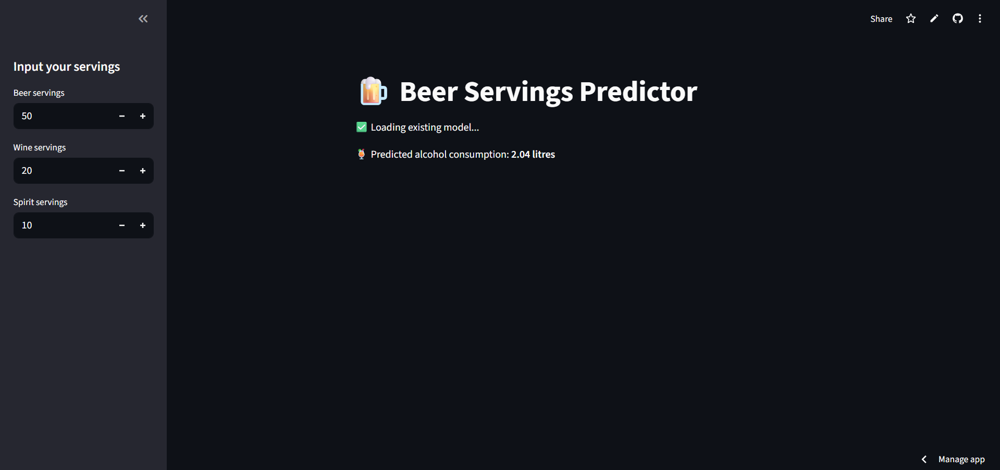
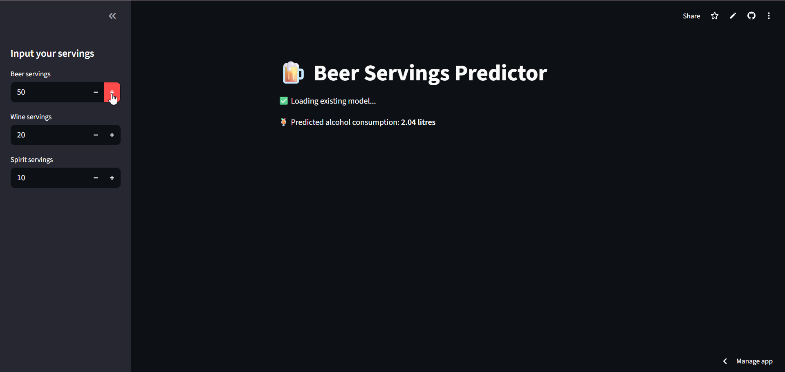

# 🍺 Beer Servings Predictor

A simple Python/Streamlit web app that predicts alcohol consumption based on beer, wine, and spirit servings. The app also includes a script to train the prediction model using your dataset.

---

## 📂 Project Structure

beer-app/

├── app.py # Main Streamlit app

├── train_model.py # Script to train and save the model

├── beer-servings.csv # Dataset

├── beer_servings_model.pkl # Saved trained model

├── requirements.txt # Python dependencies


## 🛠 Features

- Predict alcohol consumption based on user input for beer, wine, and spirit servings.
- Automatically trains the model if it doesn’t exist.
- Handles missing values in the dataset.
- Interactive Streamlit web interface.


## 💻 Installation / Setup

1. **Clone the repository**

```bash
git clone <your-repo-url>
cd <repo-folder>
```

2. **Create and activate a virtual environment**

```bash
# Windows
python -m venv venv
.\venv\Scripts\Activate

# macOS/Linux
python3 -m venv venv
source venv/bin/activate
```
3. **Install dependencies**

```bash
pip install -r beer-app/requirements.txt
```

##🚀 Running the App

1. **Train the model (if not already trained)**

```bash
python beer-app/train_model.py
```

2. **Run the Streamlit app**

```bash
streamlit run beer-app/app.py
```

3. **Open the URL provided by Streamlit in your browser.**


##⚙️ Usage

-Enter your beer, wine, and spirit servings in the sidebar.
-The app will predict total alcohol consumption in litres.

##📸 Screenshots / GIFs

1. App Interface Screenshot



2. Demo GIF



##📦 Dependencies

-Python 3.13+
-pandas
-scikit-learn
-joblib
-streamlit

See beer-app/requirements.txt for full details.

##📝 Notes

-Ensure beer-servings.csv is in the beer-app folder.
-Missing values in the CSV are handled automatically.
-The app loads the model from beer_servings_model.pkl; if missing, it will train a new model.

##🧑‍💻 Author

Mathew Jacob
